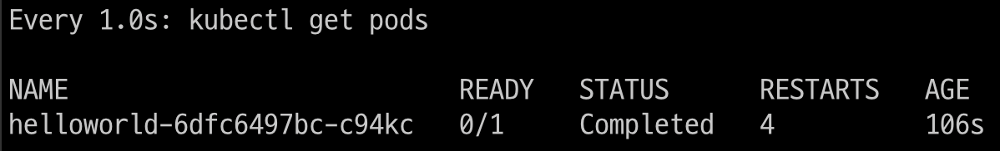
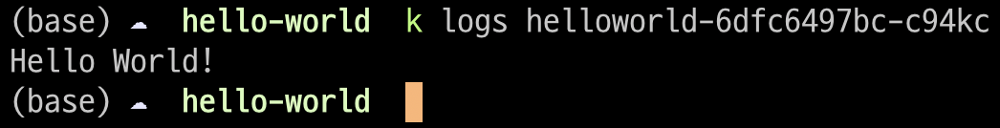
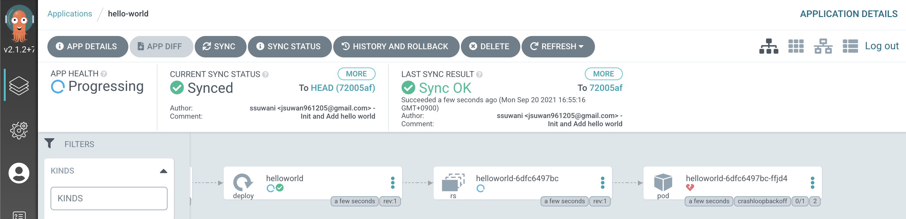
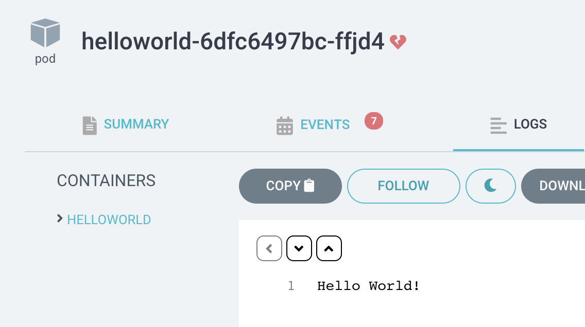

# Hello World 출력하기

"Hello World"를 출력하는 Docker Image를 만들고 이를 ArgoCD를 통해서 배포해보겠다.

필요한 파일은 3가지이다.

1. main.py
2. dockerfile
3. hello-world.yaml

**main.py** 
Hello World를 출력한다.

**dockerfile** 
main.py를 Docker 이미지로 만들어준다.

**hello-world.yaml** 
위에서 만든 이미지를 실행하는 Pod를 생성한다. (Deployment 형태)

## ArgoCD에 올리기 전 테스트

ArgoCD를 통한 관리를 하기 전 만든 동작이 문제없는지 확인하는 것이 좋다고 생각한다.

    k create -f hello-world.yaml

Pod가 잘 생성되었고 Pod의 Log를 확인해보자.

잘 동작한 것을 확인할 수 있다.

하지만 Complete와 CrashLoopBackOff가 반복해서 출력된다. CrashLoopBackOff는 파드가 비정상 종료되었을 때 나타나는 에러메시지 라고한다. 정확한 이유는 모르겠지만 HelloWorld만을 출력하는것이다 보니 이렇게 문제가 되는듯하다.

## 배포 자동화하기

Github에 hello-world.yaml 파일을 올리고 이를 ArgoCD에서 자동으로 배포하도록 하자.

아래 첫번째 사진과 같이 Pod가 생성 되었고, 두번째 사진과 같이 Log에선 HelloWorld가 출력되었다. 하지만 위에서 본것과 같이 Complete와 CrashLoopBackOff가 반복된다.

